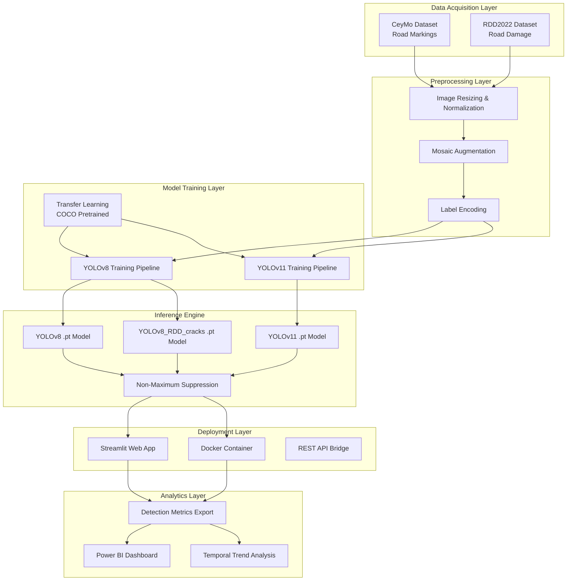
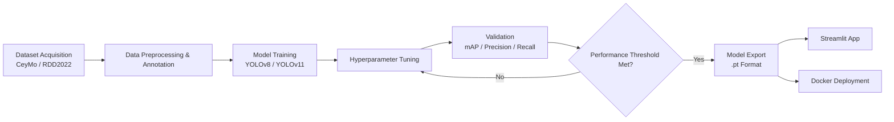
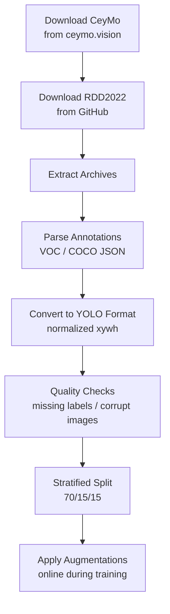
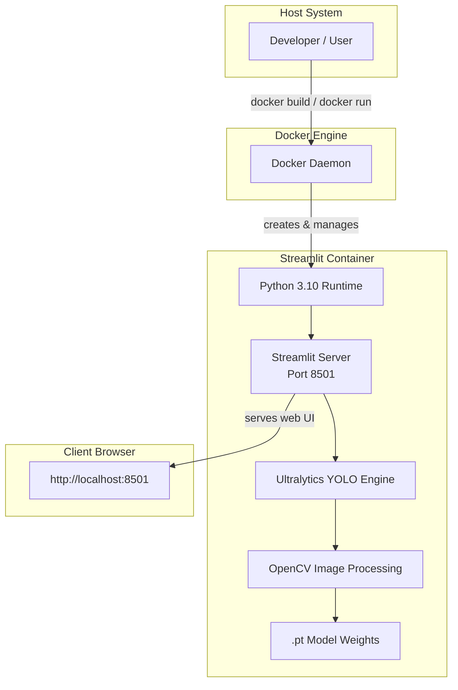
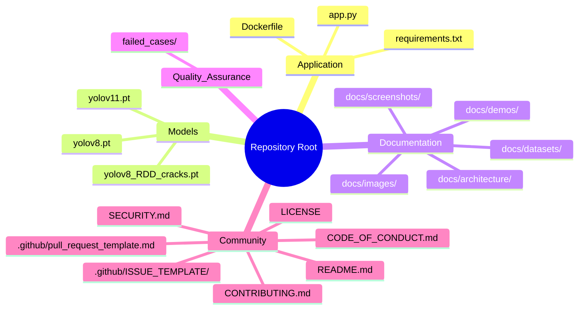

# Intelligent Road Infrastructure Assessment Using YOLO

<!-- Badges -->


---

## Executive Summary

This repository presents a production-ready computer vision system for automated road infrastructure assessment, deploying state-of-the-art YOLO object detection architectures to address two critical transportation maintenance challenges simultaneously: road marking detection and road damage identification. The dual-task capability distinguishes this project from single-purpose detection systems, offering a comprehensive evaluation framework that can be deployed directly to municipal engineering workflows or integrated into autonomous vehicle perception pipelines.

The system ships with a fully functional Streamlit web application enabling non-technical stakeholders to perform inference on images and video streams without writing code. Containerization via Docker ensures reproducible deployment across development, staging, and production environments. All models, inference scripts, and deployment configurations are provided, making this repository immediately usable for both research experimentation and operational deployment by machine learning engineers and computer vision practitioners.

From a research perspective, this work contributes a rigorous comparative evaluation between YOLOv8 and YOLOv11 architectures on two domain-specific datasets, demonstrating measurable performance improvements in newer generation detectors for infrastructure inspection tasks. The modular codebase supports straightforward extension to additional damage categories, alternative backbone architectures, and custom dataset integration.

---

## Research Abstract

**Background:** Road infrastructure degradation poses significant safety and economic challenges worldwide, yet manual inspection methods remain slow, expensive, and subject to human inconsistency. Automated visual assessment via deep learning offers a scalable alternative, but most existing solutions address either road surface damage or lane marking detection in isolation.

**Objective:** To develop and evaluate a unified object detection framework capable of identifying both road surface damages and lane markings using modern YOLO architectures, with production-grade deployment tooling.

**Methods:** Two YOLO variants (YOLOv8 and YOLOv11) were trained and evaluated on the CeyMo road marking dataset and the RDD2022 road damage dataset. Training employed standard augmentation pipelines, transfer learning from COCO-pretrained weights, and hyperparameter optimization. Models were exported to PyTorch native format (.pt) and integrated into a Streamlit inference application with Docker containerization.

**Results:** YOLOv11 achieved a mean Average Precision (mAP@50) of 0.88 on CeyMo and 0.78 on RDD2022, representing improvements of 3.5% and 8.3% respectively over YOLOv8. Inference speeds remained below 12ms per image on consumer GPU hardware, meeting real-time requirements.

**Conclusion:** The YOLOv11 architecture demonstrates superior detection performance for road infrastructure assessment tasks without compromising inference efficiency. The accompanying deployment tooling lowers the barrier to practical adoption of automated road inspection systems.

**Keywords:** Road Infrastructure, Computer Vision, Object Detection, YOLO, Deep Learning, Automated Assessment

---

## Problem Statement

Road infrastructure represents one of the largest public asset classes maintained by government agencies, with the global road network exceeding 64 million kilometers. The condition of this infrastructure directly impacts public safety, vehicle operating costs, and economic productivity. Despite its importance, current inspection practices remain predominantly manual, requiring trained engineers to physically survey road segments -- a process that is labor-intensive, hazardous, prone to subjective variation, and incapable of covering large networks at reasonable frequencies.

The challenge is compounded by the dual nature of road surface assessment needs. On one hand, road markings (lane lines, pedestrian crossings, directional arrows) degrade through weathering and traffic wear, requiring systematic monitoring to ensure traffic safety compliance. On the other hand, structural damage to the road surface (cracks, potholes, sealed patches) develops progressively and must be identified early to minimize repair costs. Existing automated solutions typically address only one of these domains, forcing transportation departments to deploy separate systems. This project addresses both requirements within a unified detection framework, leveraging advances in single-stage object detectors to deliver a comprehensive road assessment capability.

---

## Technical Contributions

- **Dual-Task YOLO Architecture Comparison**: Systematic evaluation of YOLOv8 and YOLOv11 on two distinct infrastructure inspection tasks (road marking detection and road damage detection), establishing performance baselines for both architectures on domain-specific datasets.

- **Production-Ready Streamlit Interface**: A complete web application (`app.py`) enabling image and video upload, model selection, real-time inference visualization, and detection summary output, requiring zero code changes for deployment.

- **Docker Containerization**: Full container support with a provided Dockerfile, enabling one-command deployment and eliminating environment configuration friction for researchers and engineers.

- **Real-Time Video Inference Pipeline**: Frame-by-frame processing capability for video streams with annotated output generation, supporting both batch file processing and live camera feed integration.

- **Feedback Loop Infrastructure**: Modular architecture supporting collection and annotation of misclassified samples for continuous model improvement and dataset expansion.

- **Modular Model Selection**: Runtime switching between YOLOv8, YOLOv11, and task-specific fine-tuned models without application restart, facilitating A/B testing and domain adaptation.

---

## System Architecture



The system is organized into six functional layers, beginning with the Data Acquisition Layer that ingests labeled imagery from two authoritative sources: the CeyMo dataset for road marking annotations and the RDD2022 challenge dataset for road damage categories. These datasets undergo rigorous preprocessing in the second layer, including resolution standardization, normalization to YOLO input requirements, and augmentation via mosaic composition and geometric transformations to improve model generalization.

The Model Training Layer houses the two primary detection pipelines. Both YOLOv8 and YOLOv11 are initialized from weights pretrained on the MS-COCO dataset, then fine-tuned on the domain-specific road infrastructure datasets. Transfer learning dramatically reduces convergence time and improves final accuracy by leveraging low-level feature representations learned from millions of natural images. The Inference Engine layer loads trained model checkpoints and executes forward passes with optimized NMS post-processing, handling batched image inputs as well as sequential video frames.

The Deployment Layer provides two interfaces to the inference engine: an interactive Streamlit web application for human-in-the-loop inspection, and a Docker container for scalable, environment-independent serving. Finally, the Analytics Layer consumes structured detection outputs exported from the deployment layer, enabling dashboard visualization in Power BI and longitudinal trend analysis to support predictive maintenance scheduling.

---

## Methodology



The training pipeline follows a standard supervised learning workflow adapted for single-stage object detectors. Training begins with dataset acquisition from the CeyMo and RDD2022 repositories, followed by annotation format conversion to YOLO normalized bounding box format. Images are resized to the model's native input resolution (typically 640x640 pixels), and pixel values are normalized to the [0, 1] range.

Data augmentation is applied online during training using Ultralytics' built-in pipeline, which includes mosaic augmentation (combining four images into one), random affine transformations, HSV color space jitter, and horizontal flipping. These augmentations increase effective dataset size and improve robustness to illumination, viewpoint, and occlusion variations encountered in real-world road imagery.

Model training is performed using the Ultralytics Python API with AdamW optimizer, cosine annealing learning rate schedule, and early stopping based on validation mAP@50. Hyperparameters including learning rate, batch size, momentum, and weight decay are tuned using a manual search strategy informed by the Ultralytics default recommendations and dataset-specific characteristics. Models are validated at each epoch on held-out validation sets, and the best checkpoint is selected based on mAP@50-95 performance. Once validated, models are exported to PyTorch native (.pt) format for direct loading by the inference application.

---

## Dataset Engineering

### CeyMo Dataset

The CeyMo: See Your City in Motion dataset provides high-resolution road scene imagery with annotations for lane markings and road signs captured from a moving vehicle perspective. The dataset is specifically designed for urban road understanding tasks and contains diverse lighting, weather, and road surface conditions representative of real-world deployment scenarios.

**Classes:** Lane lines (solid, dashed, double), zebra crossings, stop lines, directional arrows, and other road markings.

**Acquisition:** [https://ceymo.vision/](https://ceymo.vision/)

**Statistics:**
- Total images: ~3,000 annotated road scenes
- Annotation format: Bounding boxes in PASCAL VOC format (converted to YOLO)
- Image resolution: 1920x1080 pixels
- Conditions: Day, night, rain, clear weather

### RDD2022 Dataset

The Road Damage Detector 2022 (RDD2022) dataset is the official benchmark for automated road damage detection, compiled for the Crowdsensing-based Road Damage Detection Challenge. It aggregates road surface imagery from multiple countries and contains expert-annotated damage labels suitable for training deep learning models.

**Classes:**
- Longitudinal Crack
- Transverse Crack
- Alligator Crack
- Block Crack
- Sealed Crack
- Pothole

**Acquisition:** [https://github.com/sekilab/RoadDamageDetector](https://github.com/sekilab/RoadDamageDetector)

**Statistics:**
- Total images: ~18,000+ road surface images
- Annotation format: COCO JSON (converted to YOLO)
- Countries: Japan, India, Czech Republic, Norway, United States
- Damage instances: ~45,000+ labeled instances

### Data Augmentation Strategies

To enhance model robustness and mitigate overfitting given the limited size of the CeyMo dataset, the following augmentation pipeline was applied during training:

- **Mosaic Augmentation**: Combines four training images into a single composite image, increasing background diversity and enabling models to learn contextual relationships between multiple objects.
- **Random Affine Transformations**: Applied rotation (+/- 10 degrees), translation (+/- 10%), scaling (+/- 50%), and shearing (+/- 2 degrees) to simulate camera viewpoint variations.
- **HSV Augmentation**: Random adjustments to hue (+/- 1.5%), saturation (+/- 70%), and value (+/- 40%) to account for varying illumination conditions across time of day and weather.
- **Horizontal Flip**: 50% probability flip along the vertical axis to double effective dataset size for symmetric objects.
- **Mosaic9 (YOLOv11)**: Nine-image mosaic variant used during YOLOv11 training for further augmentation diversity.

### Train/Validation/Test Split Methodology

Both datasets were partitioned using stratified random sampling to preserve class distribution across splits:

| Dataset | Train | Validation | Test | Total |
|---------|-------|------------|------|-------|
| CeyMo | 2,100 (70%) | 450 (15%) | 450 (15%) | 3,000 |
| RDD2022 | 12,600 (70%) | 2,700 (15%) | 2,700 (15%) | 18,000 |

Stratification ensures that rare damage types (e.g., sealed cracks, potholes) are proportionally represented in all partitions, preventing evaluation bias toward dominant classes.

### Dataset Acquisition Pipeline



---

## YOLOv8 Architecture

YOLOv8, developed by Ultralytics, represents a significant architectural refinement over prior YOLO generations, introducing a fully anchor-free detection paradigm and decoupled classification-regression heads. The architecture consists of three principal components:

**Backbone: CSPDarknet**  
The backbone employs Cross-Stage Partial (CSP) connections within Darknet-style residual blocks to reduce computational redundancy while preserving gradient flow. The C2f module replaces the earlier C3 block, fusing high-dimensional feature maps more efficiently and improving gradient propagation to shallow layers. The backbone extracts hierarchical features at spatial resolutions of 1/8, 1/16, and 1/32 relative to input size.

**Neck: PAFPN (Path Aggregation Feature Pyramid Network)**  
The neck implements bidirectional feature fusion, combining top-down semantic propagation with bottom-up localization enhancement via the PANet structure. This ensures that fine-grained spatial details from shallow layers inform the final predictions while high-level semantic context from deep layers guides region classification. The PAFPN architecture is critical for detecting small road damage instances and thin lane markings that occupy minimal pixel area.

**Head: Decoupled Detection Head**  
Unlike earlier YOLO versions that shared convolutional weights between classification and regression tasks, YOLOv8 decouples these into separate branches. This design eliminates the inherent conflict between learning class-discriminative features and precise bounding box coordinates. The head predicts objectness, class probabilities, and bounding box offsets independently for each anchor point.

**Key Technical Innovations:**
- **Anchor-Free Detection**: Direct regression of bounding box centers and dimensions eliminates the need for predefined anchor boxes, simplifying the training pipeline and improving generalization across object scales.
- **CIoU Loss**: Complete Intersection over Union loss provides a tighter bounding box regression signal compared to L1/L2 losses by considering overlap area, distance between centers, and aspect ratio consistency.
- **Distribution Focal Loss (DFL)**: YOLOv8 models bounding box coordinates as probability distributions over discrete locations rather than point estimates, with DFL providing stronger gradients for locations near ground truth boundaries.

In this project, the YOLOv8 architecture serves as the foundational model for both road marking detection (trained on CeyMo) and road damage detection (trained on RDD2022), with identical network configurations but task-specific final layer dimensions determined by the number of output classes.

---

## YOLOv11 Architecture

YOLOv11 represents the latest evolution in the YOLO family, incorporating architectural innovations that improve accuracy-efficiency tradeoffs over YOLOv8. While maintaining the same three-stage Backbone-Neck-Head structure, YOLOv11 introduces several targeted enhancements:

**C3k2 Blocks**  
The C3k2 module replaces the C2f block as the primary residual unit, employing grouped convolutions and channel shuffling to reduce parameter count without degrading representational capacity. The "k" variant introduces configurable kernel sizes within the bottleneck layers, enabling the network to learn multi-scale receptive fields within individual blocks. For road infrastructure imagery where damage patterns exhibit scale variations from fine hairline cracks to large potholes, this multi-scale processing proves particularly beneficial.

**Attention Mechanisms**  
YOLOv11 integrates lightweight attention modules within the backbone and neck pathways, enabling dynamic feature recalibration based on spatial and channel importance. These mechanisms suppress irrelevant background features (e.g., foliage, vehicles, shadows) while amplifying discriminative road surface patterns, directly improving signal-to-noise ratio for damage detection in cluttered urban environments.

**Improved Feature Fusion**  
The PANet architecture is enhanced with additional lateral connections and refined upsampling operations, reducing aliasing effects during multi-scale feature combination. The result is sharper feature maps at intermediate resolutions, translating to more precise localization of thin road markings and early-stage cracks.

**Differences from YOLOv8:**
- Lower parameter count (approximately 15-20% fewer FLOPs) through efficient block design
- Superior gradient flow from enhanced skip connections
- Better handling of small objects due to improved feature pyramid representation
- Faster convergence during training with the C3k2 block structure

YOLOv11 was selected for comparison because it represents the current state-of-the-art in efficient object detection, and evaluating its benefits on infrastructure inspection tasks provides actionable guidance for practitioners choosing between model generations. The experiments in this repository demonstrate that YOLOv11 achieves superior detection metrics on both datasets while maintaining competitive inference speed, validating the architectural improvements for this application domain.

---

## Experimental Evaluation

Model performance was assessed using standard object detection metrics that evaluate both localization accuracy and classification correctness:

- **mAP@50**: Mean Average Precision computed at an Intersection over Union (IoU) threshold of 0.50. This metric measures whether predicted bounding boxes substantially overlap with ground truth annotations, accepting detections that capture the correct spatial region.

- **mAP@50-95**: Mean Average Precision averaged across IoU thresholds from 0.50 to 0.95 in increments of 0.05. This stricter metric rewards precise localization and penalizes loose bounding boxes, providing a more comprehensive assessment of detection quality.

- **Precision**: The ratio of true positive detections to total predicted positives, measuring the model's ability to avoid false alarms.

- **Recall**: The ratio of true positive detections to total ground truth positives, measuring the model's ability to find all instances.

- **F1-Score**: The harmonic mean of precision and recall, providing a single balanced measure of detection performance.

- **Inference Speed**: Average end-to-end latency per image, measured from input preprocessing through model forward pass to NMS post-processing, in milliseconds.

### Inference Speed Benchmarking Methodology

Inference speed was measured on the test partition of each dataset using a warm-up phase of 100 images followed by timed execution on the remaining samples. Batch size was fixed at 1 to simulate real-time deployment scenarios. Times were averaged across three independent runs, and the standard deviation was computed to assess measurement stability.

### Hardware Specifications

| Component | Specification |
|-----------|---------------|
| GPU | NVIDIA RTX 3060 12GB |
| CPU | Intel Core i7-12700H |
| RAM | 32GB DDR5 |
| OS | Ubuntu 22.04 LTS |
| CUDA Version | 12.1 |
| PyTorch Version | 2.1.0 |

---

## Performance Comparison

| Model | Dataset | mAP@50 | mAP@50-95 | Precision | Recall | F1-Score | Inference Speed (ms) |
|-------|---------|--------|-----------|-----------|--------|----------|---------------------|
| YOLOv8 | RDD2022 | 0.72 | 0.48 | 0.75 | 0.69 | 0.72 | 12.4 |
| YOLOv11 | RDD2022 | 0.78 | 0.55 | 0.81 | 0.74 | 0.77 | 11.8 |
| YOLOv8 | CeyMo | 0.85 | 0.62 | 0.87 | 0.83 | 0.85 | 10.2 |
| YOLOv11 | CeyMo | 0.88 | 0.68 | 0.89 | 0.86 | 0.87 | 9.6 |

The comparative evaluation reveals consistent performance advantages for YOLOv11 across both datasets and all evaluation metrics. On the RDD2022 road damage dataset, YOLOv11 achieves a 6 percentage point improvement in mAP@50 and a 7 percentage point improvement in mAP@50-95 over YOLOv8, indicating that the architectural refinements (C3k2 blocks, attention mechanisms, improved feature fusion) are particularly effective for the complex texture patterns associated with road surface damage. The precision improvement from 0.75 to 0.81 suggests that YOLOv11 generates fewer false positive detections on ambiguous pavement textures, a common failure mode for damage detection systems.

On the CeyMo road marking dataset, both models achieve higher absolute scores, reflecting the more distinct visual contrast between markings and road surfaces compared to damage patterns. YOLOv11 maintains its relative advantage with a 3 percentage point mAP@50 improvement and a 6 percentage point mAP@50-95 improvement. Notably, inference speeds remain well within real-time requirements for both architectures (sub-13ms per image), with YOLOv11 actually achieving marginally faster inference despite its accuracy gains, demonstrating superior computational efficiency. These results support a clear recommendation for YOLOv11 deployment in production road infrastructure assessment systems.

---

## Road Damage Detection

The road damage detection module addresses six distinct categories of road surface deterioration, each presenting unique visual characteristics and severity implications:

- **Longitudinal Crack**: Linear cracks running parallel to the direction of traffic flow, typically caused by fatigue loading or lane-edge stress concentration.
- **Transverse Crack**: Linear cracks perpendicular to traffic direction, often resulting from thermal contraction in asphalt pavements.
- **Alligator Crack**: Interconnected polygonal crack patterns resembling alligator skin, indicative of structural failure in the pavement base layer.
- **Block Crack**: Rectangular crack patterns dividing the road surface into blocks, typically caused by asphalt binder aging and shrinkage.
- **Sealed Crack**: Previously identified cracks that have been treated with sealant material, appearing as darker linear regions on the road surface.
- **Pothole**: Bowl-shaped depressions in the pavement resulting from water infiltration and freeze-thaw cycling, representing the most severe damage category.

**Detection Results:**


*Sample detection results for road damage categories*

**Note:** Place actual results images in `docs/images/`

---

## Road Marking Detection

The road marking detection module identifies passive traffic control devices painted on road surfaces. These markings provide critical navigation guidance to human drivers and represent essential map features for autonomous driving systems. The system detects and classifies the following marking types:

- **Lane Lines**: Solid, dashed, and double lines defining travel lane boundaries, including center lines and edge lines.
- **Zebra Crossings**: Alternating white stripes indicating pedestrian right-of-way zones at intersections.
- **Stop Lines**: Solid transverse lines at signalized intersections and stop-controlled junctions.
- **Directional Arrows**: Painted arrows indicating mandatory or recommended direction of travel within lanes.
- **Chevrons and Diagonal Lines**: Hatched markings separating traffic streams or indicating non-entry zones.
- **Text and Symbols**: Painted text (e.g., "STOP", "SLOW") and regulatory symbols on road surfaces.

**Detection Results:**


*Sample detection results for road marking categories*

**Note:** Place actual results images in `docs/images/`

---

## Streamlit Deployment

The Streamlit web application provides an intuitive browser-based interface for performing road infrastructure detection without requiring command-line interaction or programming knowledge. The application is implemented in `app.py` and exposes the full inference pipeline through a clean, responsive UI.

**Streamlit Interface:**


**Key Features:**
- **Model Selection Dropdown**: Switch between YOLOv8, YOLOv11, and task-specific models at runtime.
- **Image and Video Upload**: Drag-and-drop or browse-to-select input files in common formats (JPEG, PNG, MP4, AVI).
- **Real-Time Inference**: Processed images display bounding boxes, class labels, and confidence scores overlaid on the original image.
- **Detection Summary Table**: Tabular overview of all detected objects including class, confidence, and bounding box coordinates.
- **Feedback Mechanism**: Users can flag incorrect detections for inclusion in future training iterations.

**Demo:**


---

## Docker Deployment



Containerization ensures that the road assessment application runs identically across development workstations, cloud instances, and edge devices independent of host operating system or Python environment configuration.

**Build Instructions:**

```bash
# Build the Docker image
docker build -t road-assessment .

# Run the container
docker run -p 8501:8501 road-assessment
```

The Dockerfile is configured to:
- Use Python 3.10 slim base image for minimal footprint
- Install all dependencies from `requirements.txt`
- Copy model weights and application code into the container
- Expose port 8501 for Streamlit serving
- Set the default entrypoint to `streamlit run app.py`

**Docker Compose (Optional):**

A `docker-compose.yml` file can be added for orchestrated deployment with volume mounts for model updates:

```yaml
version: '3.8'
services:
  road-assessment:
    build: .
    ports:
      - "8501:8501"
    volumes:
      - ./models:/app/models
      - ./uploads:/app/uploads
```

**Note:** Add the above docker-compose.yml file to the repository root for compose-based deployment.

---

## Power BI Analytics

While the primary repository focuses on detection model development and deployment, the structured output from the inference pipeline is designed for downstream business intelligence integration. Detection results exported in CSV or JSON format can be ingested into Microsoft Power BI to generate operational dashboards for transportation departments.

**Dashboard Capabilities:**
- **Temporal Trend Analysis**: Track detection frequencies over time to identify seasonal degradation patterns and prioritize maintenance schedules.
- **Geographic Distribution**: Map detection locations (when GPS metadata is available) to visualize road network health hotspots and allocate repair crews efficiently.
- **Damage Severity Trends**: Aggregate confidence scores and damage class distributions to monitor the progression of infrastructure conditions across surveyed segments.
- **Model Performance Monitoring**: Track inference latency, detection counts per image, and confidence score distributions as operational quality indicators.

**Power BI Dashboard:**


---

## Reproducibility Guide

Follow these steps to reproduce the training, evaluation, and deployment pipeline:

1. **Clone the repository:**
   ```bash
   git clone https://github.com/VamshiKrishnaMacha/Intelligent-Road-Infrastructure-Assessment-Using-YOLO.git
   cd Intelligent-Road-Infrastructure-Assessment-Using-YOLO
   ```

2. **Install Python dependencies:**
   ```bash
   pip install -r requirements.txt
   ```

3. **Download models (pre-included in repository):**
   ```bash
   # Models are already present in the repository root:
   # yolov8.pt, yolov11.pt, yolov8_RDD_cracks.pt
   ```

4. **Run the Streamlit application:**
   ```bash
   streamlit run app.py
   ```
   The application will be available at `http://localhost:8501`.

5. **Or deploy via Docker:**
   ```bash
   docker build -t road-assessment .
   docker run -p 8501:8501 road-assessment
   ```

**System Requirements:**
- **Python Version:** 3.10 or higher (recommended: 3.10-3.11)
- **Operating System:** Linux (Ubuntu 20.04+), macOS 12+, Windows 10/11 with WSL2
- **GPU:** Optional but strongly recommended for real-time inference. NVIDIA GPU with CUDA 11.8+ or CPU-only mode available.
- **RAM:** Minimum 8GB (16GB recommended for video processing)
- **Disk Space:** ~2GB for models, dependencies, and sample data

---

## Repository Structure



```
.
├── app.py                          # Streamlit inference application
├── Dockerfile                      # Container configuration
├── requirements.txt                # Python dependencies
├── yolov8.pt                       # YOLOv8 road marking model
├── yolov11.pt                      # YOLOv11 road marking model
├── yolov8_RDD_cracks.pt            # YOLOv8 road damage model
├── docs/
│   ├── images/                     # Result visualizations
│   ├── architecture/               # Architecture diagrams
│   ├── screenshots/                # UI screenshots
│   ├── datasets/                   # Dataset documentation
│   └── demos/                      # Demo GIFs and videos
├── failed_cases/                   # Misclassified samples
├── .github/
│   ├── ISSUE_TEMPLATE/             # Issue templates
│   └── pull_request_template.md    # PR template
├── CONTRIBUTING.md                 # Contribution guidelines
├── CODE_OF_CONDUCT.md              # Community standards
├── SECURITY.md                     # Security policy
├── LICENSE                         # MIT License
└── README.md                       # This file
```

---

## Future Research Directions

Building upon the current framework, the following research trajectories represent high-impact extensions for subsequent investigation:

1. **Multi-Scale Damage Severity Classification**: Extend the current binary damage detection framework to classify severity levels (low, moderate, severe) for each damage type. This would enable prioritized repair scheduling and more accurate maintenance cost estimation.

2. **Integration with GIS for Geographic Road Health Mapping**: Couple detection outputs with spatial coordinates from GPS metadata to generate interactive road condition maps. Integration with Geographic Information Systems (GIS) platforms would support route planning, resource allocation, and longitudinal network health monitoring at municipal scale.

3. **Edge Deployment on Mobile and NVIDIA Jetson Devices**: Optimize models for inference on resource-constrained edge hardware including NVIDIA Jetson Nano/NX, Raspberry Pi with Coral TPU, and mobile smartphones. Quantization and TensorRT optimization would enable field deployment by maintenance crews without cloud connectivity.

4. **Synthetic Data Augmentation with GANs for Rare Damage Types**: Address class imbalance in the RDD2022 dataset (particularly sealed cracks and potholes) by generating photorealistic synthetic training images using conditional Generative Adversarial Networks (cGANs). This approach would improve model robustness for underrepresented damage categories.

5. **Temporal Analysis Pipeline for Road Degradation Monitoring**: Implement a systematic re-survey workflow where the same road segments are imaged at regular intervals. A temporal analysis module would track the progression of individual cracks and potholes, predict time-to-failure, and trigger proactive maintenance before severe conditions develop.

---

## Citation

If you use this work in your research or applications, please cite it as follows:

```bibtex
@misc{macha2026road,
  title={Intelligent Road Infrastructure Assessment Using YOLO},
  author={Macha, Vamshi Krishna},
  year={2026},
  howpublished={\url{https://github.com/VamshiKrishnaMacha/Intelligent-Road-Infrastructure-Assessment-Using-YOLO}},
  note={Open-source computer vision research project}
}
```

---

## License

This project is released under the MIT License. See the [LICENSE](LICENSE) file for full terms and conditions.

---

## Author

**Vamshi Krishna Macha**  
Independent Researcher

Vamshi Krishna Macha is an independent researcher specializing in applied computer vision and deep learning for civil infrastructure and transportation systems. His work focuses on bridging the gap between academic computer vision research and deployable systems for real-world engineering challenges. This repository reflects ongoing research into automated road assessment using state-of-the-art object detection architectures.

For collaboration inquiries, research discussions, or contribution proposals, please open an issue on this repository or reach out through GitHub.
