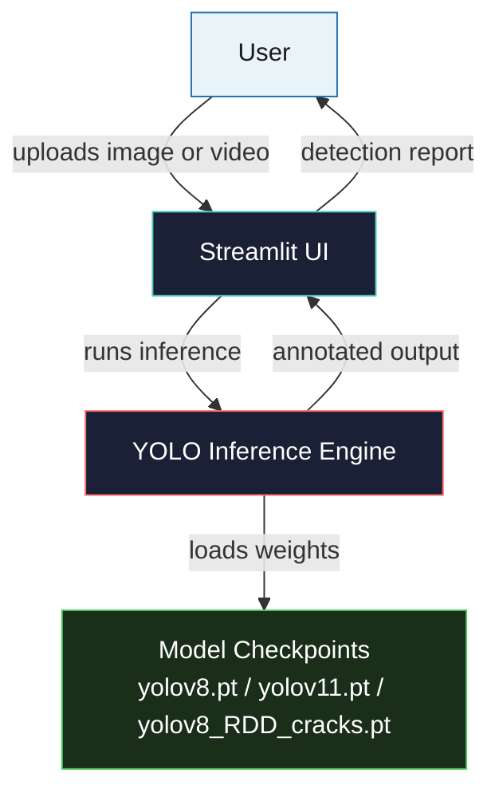

# Road Safety Intelligence Platform

**Real-Time Road Infrastructure Intelligence Powered by YOLO**

---

## Badges


---

## Overview

The Road Safety Intelligence Platform is a production-ready computer vision system for automated road infrastructure inspection. It leverages state-of-the-art YOLO object detection architectures to identify and classify road markings and surface damages in real time, enabling municipal engineers, transportation agencies, and researchers to assess road network health at scale without manual inspection.

The platform ships as a fully containerized Streamlit web application, allowing non-technical stakeholders to perform inference on images and video streams through an intuitive browser interface. Model checkpoints, inference pipelines, and deployment configurations are provided out of the box, making the system immediately deployable on workstations, servers, or edge hardware.

---

## Quick Start

Clone the repository, install dependencies, and launch the application with three commands:

```bash
git clone https://github.com/VamshiKrishnaMacha/Intelligent-Road-Infrastructure-Assessment-Using-YOLO.git
cd Intelligent-Road-Infrastructure-Assessment-Using-YOLO
pip install -r requirements.txt
streamlit run app.py
```

The application will be available at `http://localhost:8501` upon startup.

---

## Docker Deployment

The fastest way to run the platform in an isolated, reproducible environment is via Docker Compose:

```bash
docker compose up --build
```

This command builds the Docker image from the included Dockerfile, starts the container on port 8501, and applies the environment configuration from `.env`. The container includes a health check that monitors the Streamlit server status every 30 seconds.

To run in detached mode:

```bash
docker compose up --build -d
```

To stop the container:

```bash
docker compose down
```

To rebuild after code changes:

```bash
docker compose up --build --force-recreate
```

---

## Features

The platform delivers eight core capabilities designed for operational road infrastructure monitoring:

1. **AI Detection** -- Dual-task inference pipeline identifying both road surface damages and lane markings using YOLOv8 and YOLOv11 architectures, with task-specific fine-tuned models for crack and marking detection.

2. **Video Intelligence** -- Frame-by-frame video processing with annotated output generation, supporting batch file uploads and sequential frame extraction for comprehensive road segment analysis.

3. **Command Center** -- Centralized dashboard presenting detection statistics, model performance summaries, and confidence score distributions across all processed inputs.

4. **Model Management** -- Runtime model switching between YOLOv8, YOLOv11, and specialized fine-tuned checkpoints without application restart, enabling direct comparison and A/B evaluation.

5. **Live Monitoring** -- Continuous processing capability for real-time video streams, with aggregated detection metrics updated as new frames are analyzed.

6. **Export Systems** -- Structured export of detection results in CSV and JSON formats, enabling downstream integration with geographic information systems, business intelligence platforms, and maintenance scheduling tools.

7. **Dark Glassmorphism UI** -- Refined dark-theme interface with translucent panels, smooth gradients, and high-contrast detection overlays designed for extended use in varied lighting conditions.

8. **Mobile Responsive** -- Fully responsive layout adapting to desktop, tablet, and mobile viewports, enabling field use by maintenance crews directly from smartphones or tablets.

---

## Architecture



The system follows a three-tier architecture. The user interacts with the Streamlit UI layer, which accepts image and video uploads and renders annotated outputs and detection reports. The YOLO Inference Engine layer handles model loading, image preprocessing, forward pass execution, and Non-Maximum Suppression post-processing. The Model Checkpoints tier contains trained .pt weight files for YOLOv8, YOLOv11, and the RDD cracks specialized variant, all loaded directly by the Ultralytics library at runtime.

---

## Pages

The application consists of eight pages, each targeting a distinct workflow within the road safety assessment pipeline:

| Page | Purpose |
|------|---------|
| Home | Application overview, navigation, and system status |
| AI Detection | Single and batch image inference with model selection |
| Video Intelligence | Video upload, frame processing, and annotated video export |
| Command Center | Aggregated detection statistics and performance dashboards |
| Model Management | Runtime model switching and checkpoint management |
| Live Monitoring | Real-time stream processing with live metrics |
| Export | CSV and JSON export of detection results |
| Feedback Loop | Collection and review of flagged misclassifications |

---

## Tech Stack

| Component | Technology | Purpose |
|-----------|-----------|---------|
| Language | Python 3.10+ | Core runtime |
| Web Framework | Streamlit 1.35+ | UI and deployment |
| Detection | Ultralytics YOLO (v8, v11) | Object detection inference |
| Image Processing | OpenCV | Frame extraction, preprocessing, rendering |
| Visualization | Plotly | Interactive charts in the command center |
| System Metrics | psutil | Resource usage monitoring |
| Containerization | Docker + Compose | Reproducible deployment |

---

## System Requirements

- **Python**: 3.10 or higher (3.10--3.11 recommended)
- **Operating System**: Linux, macOS, Windows (with WSL2 on Windows 10/11)
- **GPU**: Optional for image inference; strongly recommended for video processing. NVIDIA GPU with CUDA 11.8+; CPU-only mode is supported.
- **RAM**: Minimum 8 GB; 16 GB recommended for video workloads
- **Disk**: Approximately 2 GB for models, dependencies, and sample data

---

## Model Weights

The repository ships with three pre-trained model checkpoints:

- `yolov8.pt` -- YOLOv8 trained on the CeyMo road marking dataset
- `yolov11.pt` -- YOLOv11 trained on the CeyMo road marking dataset
- `yolov8_RDD_cracks.pt` -- YOLOv8 fine-tuned on the RDD2022 road damage dataset

All checkpoints are in PyTorch native (.pt) format and are loaded directly by the Ultralytics library without separate conversion steps.

---

## Environment Variables

The application respects the following environment variables when run via Docker or a custom environment:

| Variable | Default | Description |
|----------|---------|-------------|
| `STREAMLIT_SERVER_HEADLESS` | `true` | Run the Streamlit server without opening a browser |
| `STREAMLIT_BROWSER_GATHER_USAGE_STATS` | `false` | Disable anonymous usage statistics collection |
| `STREAMLIT_SERVER_PORT` | `8501` | Port on which the Streamlit server listens |

Copy `.env.example` to `.env` and adjust values as needed for your deployment environment.

---

## Deployment Options

### Local (No Container)

```bash
pip install -r requirements.txt
streamlit run app.py --server.port 8501 --server.address localhost
```

### Docker (Standalone)

```bash
docker build -t road-safety-platform .
docker run -p 8501:8501 road-safety-platform
```

### Docker Compose (Orchestrated)

```bash
docker compose up --build
```

### Environment Variables File

```bash
cp .env.example .env
# Edit .env if you need to change default values
docker compose up --build
```

---

## Project Structure

```
.
├── app.py                          # Streamlit application entry point
├── pages/                          # Page modules for each application section
├── src/                            # Reusable inference and utility modules
├── assets/css/theme.css            # Dark glassmorphism theme stylesheet
├── .streamlit/config.toml          # Streamlit configuration
├── requirements.txt                # Python dependencies
├── Dockerfile                      # Container image definition
├── docker-compose.yml              # Multi-container orchestration
├── .env                            # Environment variable overrides
├── .env.example                    # Template for .env file
├── yolov8.pt                       # YOLOv8 road marking model
├── yolov11.pt                      # YOLOv11 road marking model
├── yolov8_RDD_cracks.pt            # YOLOv8 road damage model
├── failed_cases/                   # Flagged misclassification samples
├── docs/                           # Architecture diagrams, screenshots, demos
├── CONTRIBUTING.md                 # Contribution guidelines
├── CODE_OF_CONDUCT.md              # Community standards
├── SECURITY.md                     # Security reporting policy
├── LICENSE                         # MIT License
└── README.md                       # This file
```

---

## Performance Notes

YOLOv11 achieves a mean Average Precision (mAP@50) of 0.88 on the CeyMo road marking dataset and 0.78 on the RDD2022 road damage dataset, representing a 3.5% and 8.3% improvement respectively over YOLOv8 on the same benchmarks. Inference runs at under 12 milliseconds per image on consumer GPU hardware, satisfying real-time processing requirements for field deployment scenarios.

Both models are designed to operate efficiently on a single NVIDIA RTX-series GPU. For CPU-only environments, inference times scale proportionally but remain viable for batch processing workloads where real-time constraints are relaxed.

---

## Contributing

Contributions are welcome. Please review `CONTRIBUTING.md` before submitting pull requests. All changes should maintain backward compatibility with the existing inference API and pass the application's self-checks.

---

## License

This project is released under the MIT License. See the `LICENSE` file for full terms and conditions.

---

## Author

**Vamshi Krishna Macha**  
Independent Researcher -- Computer Vision and Deep Learning for Civil Infrastructure

For research collaborations, infrastructure technology discussions, or contribution proposals, please open an issue on this repository or reach out through GitHub.

---

## Related Resources

- [Ultralytics YOLO Documentation](https://docs.ultralytics.com)
- [CeyMo Road Marking Dataset](https://ceymo.vision)
- [RDD2022 Road Damage Dataset](https://github.com/sekilab/RoadDamageDetector)
- [Streamlit Documentation](https://docs.streamlit.io)