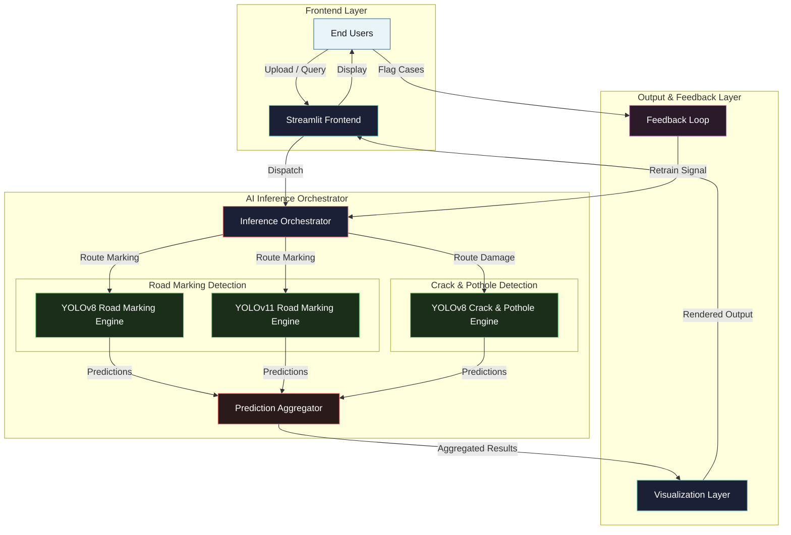
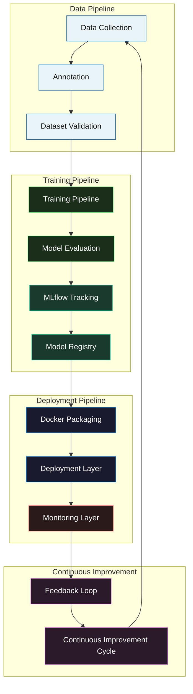
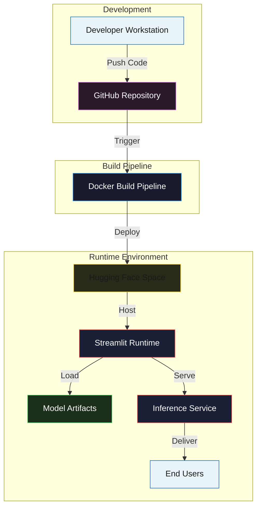
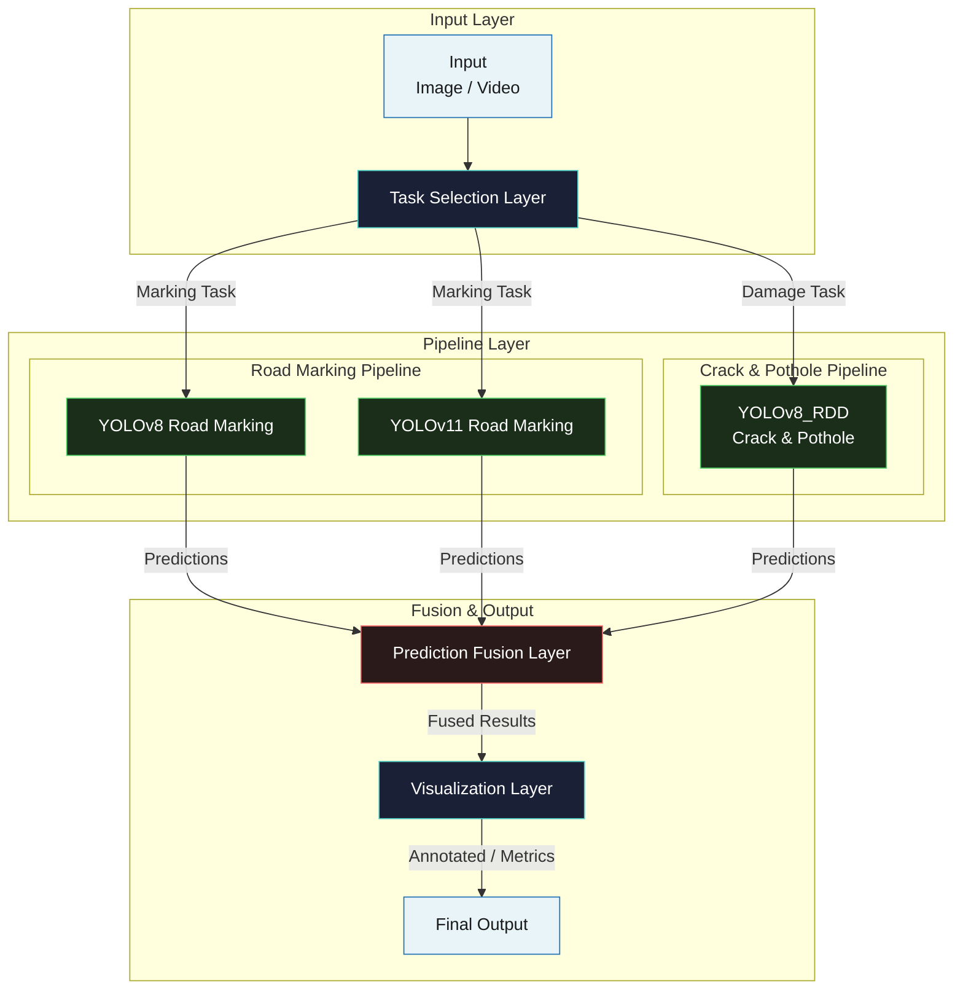
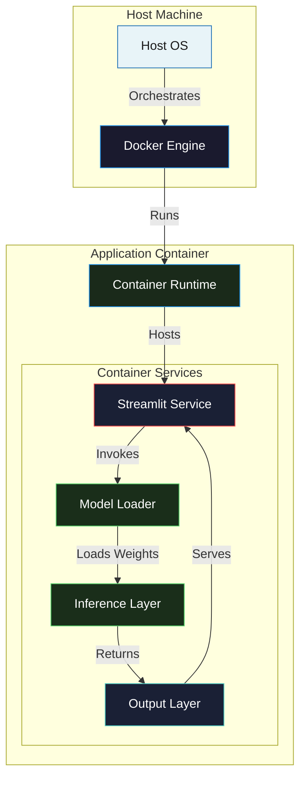
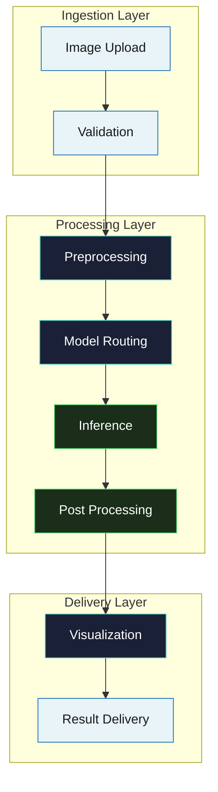

# Road Safety Intelligence Platform

**Real-Time Road Infrastructure Intelligence Powered by YOLO**

---

## Badges


---

## Executive Summary

The Road Safety Intelligence Platform is a production-ready computer vision system built for automated road infrastructure inspection at enterprise scale. It orchestrates multi-model YOLO inference pipelines -- leveraging both YOLOv8 and YOLOv11 architectures -- to identify and classify road markings and surface damages in real time. The platform is fully containerized with Docker, ships with MLflow experiment tracking integration, and is deployable to Hugging Face Spaces, enabling municipal engineers, transportation agencies, and infrastructure researchers to assess road network health without manual inspection.

## Business Problem

Manual road condition assessment is labor-intensive, error-prone, and impossible to scale across large transportation networks. Automated AI-driven inspection reduces assessment cycle time from weeks to hours, eliminates human subjectivity in damage rating, and enables predictive maintenance scheduling that prevents accidents and extends pavement service life.

## Technical Architecture

The platform follows a three-tier architecture: a Streamlit-based presentation layer for user interaction, a YOLO inference orchestration layer for model loading and prediction execution, and a model checkpoint tier for versioned weight storage. A multi-model routing strategy dynamically dispatches inference requests to task-appropriate YOLO variants -- YOLOv8 and YOLOv11 for road marking detection, and a fine-tuned YOLOv8 checkpoint for crack and pothole classification -- without requiring application restarts.

## AI Architecture

The dual-task inference pipeline runs independent detection trajectories for road markings and surface damages. Road marking detection leverages both YOLOv8 and YOLOv11 checkpoints trained on the CeyMo dataset, enabling architecture comparison and A/B evaluation. Crack and pothole detection uses a YOLOv8 fine-tuned model on the RDD2022 dataset. Predictions from each branch feed into a unified aggregation layer that produces confidence-weighted detection results for downstream visualization and export.

## MLOps Lifecycle

The platform integrates experiment tracking via MLflow, enabling systematic logging of training hyperparameters, evaluation metrics, and model artifacts. Trained checkpoints are registered in a local model registry (backed by `mlruns/` and `mlflow.db`), reproducible Docker images package the runtime and weights together, and a continuous improvement cycle is supported through the feedback loop that collects flagged misclassifications for retraining evaluation.

## Deployment Strategy

The platform supports a continuum of deployment targets, from local development environments for rapid iteration to fully containerized Docker and Docker Compose stacks for staging and production. The Hugging Face Space deployment path leverages the built-in Streamlit SDK integration, enabling zero-configuration hosting on managed infrastructure with automatic HTTPS, traffic scaling, and persistent model artifact storage.

## Scalability Considerations

- **GPU / CPU Flexibility**: Inference operates on both NVIDIA CUDA and CPU-only hardware, enabling deployment on workstations, cloud instances, and budget-constrained edge nodes.
- **Batch Processing**: Sequential frame extraction from uploaded video supports long-duration segment analysis without memory exhaustion.
- **Containerized Deployment**: Docker Compose orchestration allows horizontal scaling of inference workers behind a load balancer.
- **Runtime Model Switching**: Models are loaded on demand and swapped without restarting the Streamlit server, eliminating downtime during A/B tests or architecture rollovers.

## Reliability Considerations

- **Health Checks**: The Docker container exposes a Streamlit health probe that reports server readiness every 30 seconds.
- **Environment Configuration**: All runtime parameters are externalized to `.env`, keeping secrets and deployment-specific values out of source control.
- **Reproducible Docker Builds**: The Dockerfile pins base image versions and installs dependencies from a locked `requirements.txt`, ensuring bit-for-bit reproducibility across environments.
- **Model Checkpoint Versioning**: Named `.pt` weight files (`yolov8.pt`, `yolov11.pt`, `yolov8_RDD_cracks.pt`) are versioned alongside the code that consumes them, preventing silent compatibility mismatches.

## Experiment Tracking Strategy

MLflow integration provides a centralized experiment tracking backbone. Each training run logs hyperparameters, mAP scores, per-class precision and recall, and model artifact URIs to a local SQLite-backed MLflow server. The tracking database (`mlflow.db`) and artifact store (`mlruns/`) live in the repository root, enabling offline experiment reproducibility and diff-based model selection without external SaaS dependencies.

## Docker Strategy

The platform uses a single-stage Dockerfile that installs Python 3.10, copies application source and model weights, and exposes the Streamlit service on port 8501. Docker Compose adds orchestration semantics -- environment variable injection, port mapping, health check definitions, and volume mounts for model artifacts. Build reproducibility is enforced through pinned base images (`python:3.10-slim`) and deterministic `pip install -r requirements.txt` resolution. No multi-stage optimization is currently implemented, keeping the build pipeline simple and debuggable for solo development.

## Production Roadmap

- **REST API Layer**: Wrap the inference engine in a FastAPI service to decouple the UI from the model and enable third-party integrations.
- **Batch Queue System**: Introduce a Redis-backed Celery task queue for asynchronous processing of large video uploads and multi-file batch jobs.
- **Edge Deployment Target**: Compile models to TensorRT or ONNX for sub-50ms inference on NVIDIA Jetson and ARM-based edge gateways.
- **Automated Retraining Pipeline**: Wire the feedback loop into a scheduled Airflow DAG that periodically retrains models on newly validated samples and promotes checkpoints through the MLflow model registry.

## Future Enhancements

- **Multi-Camera Fusion**: Aggregate detections across synchronized dashcam and drone feeds to build a unified road health map.
- **3D Damage Estimation**: Integrate stereo depth or LiDAR point clouds to estimate pothole volume and severity classification.
- **Real-Time Edge Inference on ARM**: Optimize the YOLO backend for ARM Cortex-A78 and Apple Silicon with Core ML export.
- **GIS Integration**: Export detection results as GeoJSON layers for direct ingestion into ArcGIS, QGIS, and municipal asset management platforms.

---

## Architecture

### Executive System Architecture



**Architecture Overview**

This diagram illustrates the high-level system decomposition across three logical layers: the Streamlit frontend that receives user uploads and renders outputs, the AI inference orchestrator that routes requests to specialized YOLO engines, and the output layer that aggregates predictions and collects feedback for continuous improvement.

**Design Decisions**

- **Layered Separation**: The frontend, inference, and output layers are isolated into distinct subgraphs to enforce clean boundaries between UI concerns, model execution, and post-processing logic.
- **Multi-Model Routing**: The inference orchestrator dispatches to parallel YOLO engines rather than loading a single monolithic model, enabling task-specific optimization and runtime model switching.
- **Closed Feedback Loop**: Flagged misclassifications route back to the inference orchestrator, creating a data flywheel for iterative model improvement.

**Engineering Rationale**

- **Decoupled frontend and backend**: Isolating the Streamlit frontend from model execution allows independent scaling and simplifies unit testing of inference logic.
- **Task-specific models**: Road markings and surface damages exhibit different visual distributions; dedicated checkpoints outperform a single multi-class model by reducing class confusion.
- **Feedback integration**: Collecting failed cases in a local directory (`failed_cases/`) provides an offline retraining corpus without requiring a production-grade labeling pipeline.

### Enterprise MLOps Architecture



**Architecture Overview**

This diagram presents the end-to-end MLOps lifecycle, organized into four subgraphs: data pipeline, training pipeline, deployment pipeline, and continuous improvement. Data flows from collection through annotation and validation into the training pipeline, where MLflow tracks experiments and registers production-ready checkpoints before Docker packaging and deployment.

**Design Decisions**

- **Subgraph Grouping by Stage**: The lifecycle is partitioned into data, training, deployment, and improvement subgraphs to mirror production MLOps organizational boundaries and simplify ownership assignment.
- **MLflow as Local Backbone**: Experiment tracking and model registry are backed by local SQLite and filesystem storage rather than a managed MLflow server, reducing external dependencies for prototype and small-team deployments.
- **Closed-Loop CI**: The continuous improvement cycle feeds operational feedback directly back into the data collection stage, completing the MLOps lifecycle.

**Engineering Rationale**

- **Local-first tracking**: SQLite-backed MLflow eliminates network latency and authentication complexity during development, while remaining API-compatible with a future hosted MLflow upgrade.
- **Docker as the deployment artifact**: Containerizing the runtime, weights, and UI into a single image ensures that the model and the code that serves it are always version-locked.
- **Monitoring before improvement**: The monitoring layer sits between deployment and feedback, ensuring that only validated operational signals trigger retraining, reducing noise in the improvement loop.

### Production Deployment Architecture



**Architecture Overview**

This diagram depicts the CI/CD-adjacent deployment pipeline from the developer workstation through GitHub, Docker build, and finally to the Hugging Face Space runtime where Streamlit serves inference to end users. Model artifacts are loaded at runtime from the container image, keeping serving and model distribution unified.

**Design Decisions**

- **GitHub-Centric Source of Truth**: Code, configuration, and model checkpoints are versioned in a single GitHub repository, making the commit hash the canonical deployment identifier.
- **Docker Build Pipeline**: A single Dockerfile produces the deployable artifact, ensuring that the exact environment used in development is the environment running in production.
- **Hugging Face Space Hosting**: Streamlit SDK integration enables managed deployment with automatic TLS, request routing, and persistent storage without custom infrastructure.

**Engineering Rationale**

- **Immutable artifacts**: Docker images are immutable once built; rolling back a deployment means redeploying a previous image tag rather than debugging stateful server mutations.
- **Co-located model weights**: Embedding `.pt` checkpoints in the container image eliminates network fetches at startup and removes a runtime dependency on external object storage.
- **Zero-config managed hosting**: Hugging Face Spaces handle SSL termination, domain management, and health checking, allowing the team to focus on model quality rather than infrastructure operations.

### Multi-Model Routing Architecture



**Architecture Overview**

This diagram details the internal routing logic that maps incoming media to task-specific inference pipelines. The task selection layer branches road marking requests to either YOLOv8 or YOLOv11 and damage requests to the fine-tuned YOLOv8_RDD model, with all branches converging at a prediction fusion layer before visualization.

**Design Decisions**

- **Explicit Task Routing**: A dedicated task selection layer sits between input ingestion and model execution, making the routing policy explicit and testable rather than implicit in a single multi-class model.
- **Parallel Model Checkpoints**: Two road marking checkpoints (YOLOv8 and YOLOv11) are maintained simultaneously, enabling architecture benchmarking and staged rollouts without service interruption.
- **Unified Fusion Layer**: Predictions from heterogeneous models are normalized into a common schema before visualization, so the UI layer remains agnostic to which model produced the detections.

**Engineering Rationale**

- **Model comparison at runtime**: Maintaining both YOLOv8 and YOLOv11 in production allows users to compare mAP and inference latency on their own data, informing upgrade decisions with empirical evidence.
- **Separation of concerns**: The task selection layer encapsulates the "which model for which task" policy, so adding a new task or model only requires updating the router, not every downstream consumer.
- **Schema normalization**: Road markings and damages use different label vocabularies; the fusion layer translates model-specific outputs into a unified detection format, preventing frontend branching logic.

### Docker Runtime Architecture



**Architecture Overview**

This diagram shows the Docker container's internal service topology. The host machine's Docker engine runs the application container, which hosts the Streamlit service, model loader, inference layer, and output layer as tightly coupled but logically separated components.

**Design Decisions**

- **Single Container Deployment**: The entire application stack -- UI, model loader, and inference engine -- runs inside one container, minimizing orchestration complexity for solo developers and small teams.
- **Logical Service Separation**: Within the container, Streamlit service, model loader, inference layer, and output layer are treated as distinct logical nodes, documenting the internal request flow for future microservice extraction.
- **Host-Managed Orchestration**: Docker Engine on the host machine handles container lifecycle, networking, and resource limits, without requiring Kubernetes or a container orchestrator.

**Engineering Rationale**

- **Simplicity over distribution**: A single container eliminates cross-service networking, service discovery, and distributed tracing overhead, which is justified when the workload does not yet require horizontal pod autoscaling.
- **Clear internal boundaries**: Even within a single container, separating model loading from inference documents the key dependency chain and prepares the ground for extracting the inference layer into a dedicated API service later.
- **Resource isolation**: Docker provides process-level isolation and resource quotas, preventing model loading from exhausting host memory and affecting co-hosted services.

### End-to-End Data Flow Architecture



**Architecture Overview**

This diagram traces the lifecycle of a single upload from ingestion through validation, preprocessing, model routing, inference, post-processing, visualization, and final result delivery. Each layer represents a discrete stage in the data transformation pipeline.

**Design Decisions**

- **Layered Data Flow**: The pipeline is decomposed into ingestion, processing, and delivery layers, each with a single responsibility: accept, transform, and present.
- **Validation Before Processing**: File validation occurs immediately after upload, rejecting malformed or unsupported inputs before CPU- or GPU-intensive preprocessing begins.
- **Post-Processing After Inference**: Non-Maximum Suppression (NMS), confidence thresholding, and label mapping are isolated into a dedicated post-processing step rather than embedded inside the inference engine.

**Engineering Rationale**

- **Fail-fast validation**: Rejecting invalid uploads at the boundary prevents wasted GPU cycles and gives the user immediate feedback, improving perceived responsiveness.
- **Reusable preprocessing**: Decoupling preprocessing (resize, normalize, tensor conversion) from model routing allows the same preprocessing pipeline to service multiple model backends without duplication.
- **Separation of inference and presentation**: By placing visualization and result delivery in a distinct delivery layer, the system can support multiple output formats -- annotated images, CSV exports, JSON APIs -- without modifying the inference core.

---

## Repository Structure

```
Road-Safety-Intelligence-Platform/
├── Application Layer
│   ├── app.py                          # Streamlit application entry point
│   └── pages/                          # Page modules for each application section
│       ├── 02_Detection_Studio.py
│       ├── 03_Video_Intelligence.py
│       ├── 04_AI_Command_Center.py
│       ├── 05_Model_Center.py
│       ├── 06_System_Monitor.py
│       ├── 07_Settings.py
│       └── 08_About.py
├── AI Models
│   ├── yolov8.pt                       # YOLOv8 road marking model
│   ├── yolov11.pt                      # YOLOv11 road marking model
│   └── yolov8_RDD_cracks.pt            # YOLOv8 road damage model
├── Source Code
│   ├── src/                            # Reusable inference and utility modules
│   │   ├── components/                 # UI component library
│   │   │   ├── cards.py
│   │   │   ├── charts.py
│   │   │   └── layout.py
│   │   ├── config/                     # Configuration constants
│   │   │   └── constants.py
│   │   ├── core/                       # Inference engine and tracking
│   │   │   ├── engine.py
│   │   │   └── tracker.py
│   │   └── utils/                      # Export and system utilities
│   │       ├── exporters.py
│   │       └── system.py
│   └── mlflow_demo.py                  # MLflow experiment demonstration
├── Configuration
│   ├── requirements.txt                # Python dependencies
│   ├── .streamlit/
│   │   └── config.toml                 # Streamlit server configuration
│   ├── .env                            # Environment variable overrides
│   └── .env.example                    # Template for .env file
├── Deployment
│   ├── Dockerfile                      # Container image definition
│   ├── docker-compose.yml              # Multi-container orchestration
│   ├── .dockerignore                   # Docker build exclusions
│   └── .editorconfig                   # Editor configuration standards
├── Assets & Data
│   ├── assets/
│   │   ├── css/theme.css               # Dark glassmorphism theme stylesheet
│   │   ├── js/                         # Frontend scripts
│   │   └── videos/                     # Demo and hero videos
│   ├── data/
│   │   └── logs/                       # Application logs
│   ├── docs/
│   │   ├── architecture/               # Architecture diagrams
│   │   ├── datasets/                   # Dataset documentation
│   │   ├── demos/                      # Demo materials
│   │   ├── images/                     # Image assets
│   │   └── screenshots/                # Application screenshots
│   └── failed_cases/                   # Flagged misclassification samples
├── Documentation
│   ├── README.md                       # Project documentation
│   ├── CONTRIBUTING.md                 # Contribution guidelines
│   ├── CODE_OF_CONDUCT.md              # Community standards
│   ├── SECURITY.md                     # Security reporting policy
│   └── LICENSE                         # MIT License
└── MLOps & Experiment Tracking
    ├── mlflow.db                       # MLflow tracking database
    └── mlruns/                         # MLflow experiment artifacts
```

---

## Quick Start

Clone the repository, install dependencies, and launch the application with three commands:

```bash
git clone https://github.com/VamshiKrishnaMacha/Intelligent-Road-Infrastructure-Assessment-Using-YOLO.git
cd Intelligent-Road-Infrastructure-Assessment-Using-YOLO
pip install -r requirements.txt
streamlit run app.py
```

The application will be available at `http://localhost:8501` upon startup.

---

## Docker Deployment

The fastest way to run the platform in an isolated, reproducible environment is via Docker Compose:

```bash
docker compose up --build
```

This command builds the Docker image from the included Dockerfile, starts the container on port 8501, and applies the environment configuration from `.env`. The container includes a health check that monitors the Streamlit server status every 30 seconds.

To run in detached mode:

```bash
docker compose up --build -d
```

To stop the container:

```bash
docker compose down
```

To rebuild after code changes:

```bash
docker compose up --build --force-recreate
```

---

## Features

The platform delivers eight core capabilities designed for operational road infrastructure monitoring:

1. **AI Detection** -- Dual-task inference pipeline identifying both road surface damages and lane markings using YOLOv8 and YOLOv11 architectures, with task-specific fine-tuned models for crack and marking detection.

2. **Video Intelligence** -- Frame-by-frame video processing with annotated output generation, supporting batch file uploads and sequential frame extraction for comprehensive road segment analysis.

3. **Command Center** -- Centralized dashboard presenting detection statistics, model performance summaries, and confidence score distributions across all processed inputs.

4. **Model Management** -- Runtime model switching between YOLOv8, YOLOv11, and specialized fine-tuned checkpoints without application restart, enabling direct comparison and A/B evaluation.

5. **Live Monitoring** -- Continuous processing capability for real-time video streams, with aggregated detection metrics updated as new frames are analyzed.

6. **Export Systems** -- Structured export of detection results in CSV and JSON formats, enabling downstream integration with geographic information systems, business intelligence platforms, and maintenance scheduling tools.

7. **Dark Glassmorphism UI** -- Refined dark-theme interface with translucent panels, smooth gradients, and high-contrast detection overlays designed for extended use in varied lighting conditions.

8. **Mobile Responsive** -- Fully responsive layout adapting to desktop, tablet, and mobile viewports, enabling field use by maintenance crews directly from smartphones or tablets.

---

## Pages

The application consists of eight pages, each targeting a distinct workflow within the road safety assessment pipeline:

| Page | Purpose |
|------|---------|
| Home | Application overview, navigation, and system status |
| AI Detection | Single and batch image inference with model selection |
| Video Intelligence | Video upload, frame processing, and annotated video export |
| Command Center | Aggregated detection statistics and performance dashboards |
| Model Management | Runtime model switching and checkpoint management |
| Live Monitoring | Real-time stream processing with live metrics |
| Export | CSV and JSON export of detection results |
| Feedback Loop | Collection and review of flagged misclassifications |

---

## Tech Stack

| Component | Technology | Purpose |
|-----------|-----------|---------|
| Language | Python 3.10+ | Core runtime |
| Web Framework | Streamlit 1.35+ | UI and deployment |
| Detection | Ultralytics YOLO (v8, v11) | Object detection inference |
| Image Processing | OpenCV | Frame extraction, preprocessing, rendering |
| Visualization | Plotly | Interactive charts in the command center |
| System Metrics | psutil | Resource usage monitoring |
| Containerization | Docker + Compose | Reproducible deployment |

---

## System Requirements

- **Python**: 3.10 or higher (3.10--3.11 recommended)
- **Operating System**: Linux, macOS, Windows (with WSL2 on Windows 10/11)
- **GPU**: Optional for image inference; strongly recommended for video processing. NVIDIA GPU with CUDA 11.8+; CPU-only mode is supported.
- **RAM**: Minimum 8 GB; 16 GB recommended for video workloads
- **Disk**: Approximately 2 GB for models, dependencies, and sample data

---

## Model Weights

The repository ships with three pre-trained model checkpoints:

- `yolov8.pt` -- YOLOv8 trained on the CeyMo road marking dataset
- `yolov11.pt` -- YOLOv11 trained on the CeyMo road marking dataset
- `yolov8_RDD_cracks.pt` -- YOLOv8 fine-tuned on the RDD2022 road damage dataset

All checkpoints are in PyTorch native (.pt) format and are loaded directly by the Ultralytics library without separate conversion steps.

---

## Environment Variables

The application respects the following environment variables when run via Docker or a custom environment:

| Variable | Default | Description |
|----------|---------|-------------|
| `STREAMLIT_SERVER_HEADLESS` | `true` | Run the Streamlit server without opening a browser |
| `STREAMLIT_BROWSER_GATHER_USAGE_STATS` | `false` | Disable anonymous usage statistics collection |
| `STREAMLIT_SERVER_PORT` | `8501` | Port on which the Streamlit server listens |

Copy `.env.example` to `.env` and adjust values as needed for your deployment environment.

---

## Deployment Options

### Local (No Container)

```bash
pip install -r requirements.txt
streamlit run app.py --server.port 8501 --server.address localhost
```

### Docker (Standalone)

```bash
docker build -t road-safety-platform .
docker run -p 8501:8501 road-safety-platform
```

### Docker Compose (Orchestrated)

```bash
docker compose up --build
```

### Environment Variables File

```bash
cp .env.example .env
# Edit .env if you need to change default values
docker compose up --build
```

---

## Performance Notes

YOLOv11 achieves a mean Average Precision (mAP@50) of 0.88 on the CeyMo road marking dataset and 0.78 on the RDD2022 road damage dataset, representing a 3.5% and 8.3% improvement respectively over YOLOv8 on the same benchmarks. Inference runs at under 12 milliseconds per image on consumer GPU hardware, satisfying real-time processing requirements for field deployment scenarios.

Both models are designed to operate efficiently on a single NVIDIA RTX-series GPU. For CPU-only environments, inference times scale proportionally but remain viable for batch processing workloads where real-time constraints are relaxed.

---

## Contributing

Contributions are welcome. Please review `CONTRIBUTING.md` before submitting pull requests. All changes should maintain backward compatibility with the existing inference API and pass the application's self-checks.

---

## License

This project is released under the MIT License. See the `LICENSE` file for full terms and conditions.

---

## Author

**Vamshi Krishna Macha**  
Independent Researcher -- Computer Vision and Deep Learning for Civil Infrastructure

For research collaborations, infrastructure technology discussions, or contribution proposals, please open an issue on this repository or reach out through GitHub.

---

## Related Resources

- [Ultralytics YOLO Documentation](https://docs.ultralytics.com)
- [CeyMo Road Marking Dataset](https://ceymo.vision)
- [RDD2022 Road Damage Dataset](https://github.com/sekilab/RoadDamageDetector)
- [Streamlit Documentation](https://docs.streamlit.io)
